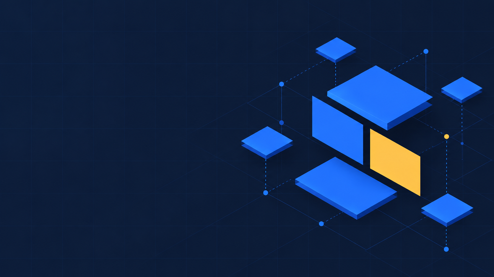

# stackkeel

A monorepo starter kit for **cross-AI development** — a production-shaped foundation you
copy, personalize in one guided session, and build on with whichever AI coding assistant
you use. Claude Code, Codex, Copilot, Cursor, and Gemini CLI all read the same
instruction file (`AGENTS.md`), the same skills (`.claude/skills/`, the Agent Skills open
standard), and hit the same git-hook + CI enforcement.

## What's in the box

**Four apps, one platform:**

| App | What it is |
|---|---|
| `apps/portal` | Member-facing Next.js app — mobile-forward, bottom-tab navigation |
| `apps/admin` | Admin control plane — users, roles, flags, audit, tickets, branding |
| `apps/shell` | Capacitor thin shell (iOS + Android) that wraps the deployed portal |
| `apps/mobile` | Expo native app consuming the portal's API with device tokens |

**Platform features, working out of the box:**

- Auth: credentials, Google, native Google Sign-In, generic OIDC (Okta/Entra/Auth0 via
  env vars), TOTP two-factor with recovery codes, account lockout
- Roles & permissions (feature catalog, anti-lockout admin role) + feature flags +
  append-only audit log
- Helpdesk: support tickets with threaded replies, attachments, an admin triage queue,
  and a feedback → ticket promotion path
- In-app user feedback with a daily prompt card; what's-new announcements
- Email through a database-backed queue with retries, backoff, and delivery webhooks
- Dynamic theming: one seed color → a generated, contrast-guaranteed token ramp (light
  and dark), applied at runtime
- Maintenance built in: scheduled cleanup jobs, health endpoint, migration guardrails

**A development workflow, not just code:**

- A six-phase agent pipeline (analyst → architect → tech-lead → implementer → qa →
  ship-it) with per-feature work-logs, evidence discipline, and periodic reviews
- Tripwire scripts and CI that enforce the workflow for *any* assistant — commit grammar,
  work-log-before-code, audit coverage, brand-token scope, defect-escape-rate stats
- **Kit sync:** forks pull kit improvements (`/upstream-sync`) and contribute fixes back
  (`/downstream-sync`) on a cadence, with a manifest (`kit.json`) tracking what was
  personalized, stripped, or fork-specific

## Quickstart

1. **Copy it** — GitHub "Use this template" (or fork/clone) into your new repo.
2. **Install** — `pnpm install` (Node ≥ 22). Git hooks install automatically.
3. **Personalize** — open the repo in your AI assistant and run `/personalize` (or point
   any Agent Skills-compatible tool at `.claude/skills/personalize/SKILL.md`). It
   interviews you for identity and branding, asks **which apps and features you actually
   need**, strips the rest cleanly, generates your brand tokens, and writes the manifest.
   Until you do this, `pnpm kit:check` (and every AI session) will keep reminding you.
4. **Run** — `pnpm dev` (portal on :3000, admin on :3001).

## Documentation

Full docs (getting started, architecture tour, the workflow, personalization and sync
guides, module catalog): **https://stackkeel.org** — or start with
[AGENTS.md](./AGENTS.md) and [docs/](./docs/) in the repo.

## Requirements

Node ≥ 22 · pnpm 10 · Postgres (Neon recommended; any Postgres works locally). Optional
services degrade gracefully when unconfigured: Resend (email), Upstash (rate limiting),
Turnstile (CAPTCHA), Google/OIDC credentials.

## License

[MIT](./LICENSE).
